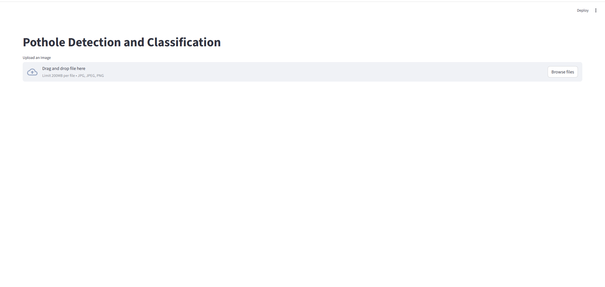
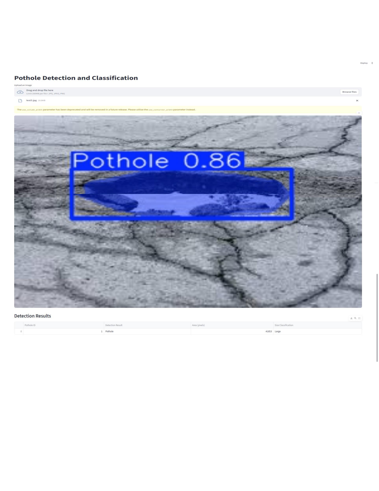

# AI-Based Pothole Severity Assessment System
## Project Overview
The AI-Based Pothole Severity Assessment System is a computer vision application developed to automatically detect potholes in road images and classify their severity based on the detected pothole area.
The system uses a YOLOv11 segmentation model to identify potholes and generate segmentation masks. The segmented pothole area is calculated in pixels and used to classify each pothole as Small, Medium, or Large.
## Business Problem
Potholes are a common road infrastructure problem that can affect vehicle safety, transportation, and road maintenance. Manual inspection of roads can require significant time and effort.
This project aims to provide an automated approach for detecting potholes from road images using computer vision and deep learning.
## Objectives
- Automatically detect potholes from road images.
- Identify the pothole region using image segmentation.
- Calculate the segmented pothole area.
- Classify potholes into Small, Medium, and Large categories.
- Provide an easy-to-use web application for pothole detection.
## Dataset
The project uses a pothole image dataset containing more than 1,000 road images.
The potholes were manually annotated using polygon-based segmentation annotations for model training.
## Model Development
YOLOv8 and YOLOv11 segmentation models were trained and compared during the project.
YOLOv11 was selected as the final model used in the deployed application.
## System Workflow
```text
Road Image
     ↓
Image Upload
     ↓
YOLOv11 Segmentation
     ↓
Pothole Detection
     ↓
Segmentation Mask
     ↓
Area Calculation
     ↓
Severity Classification
     ↓
Small / Medium / Large
     ↓
Detection Image + Results Table
## Application Screenshots
### Streamlit Application

### Pothole Detection and Results

